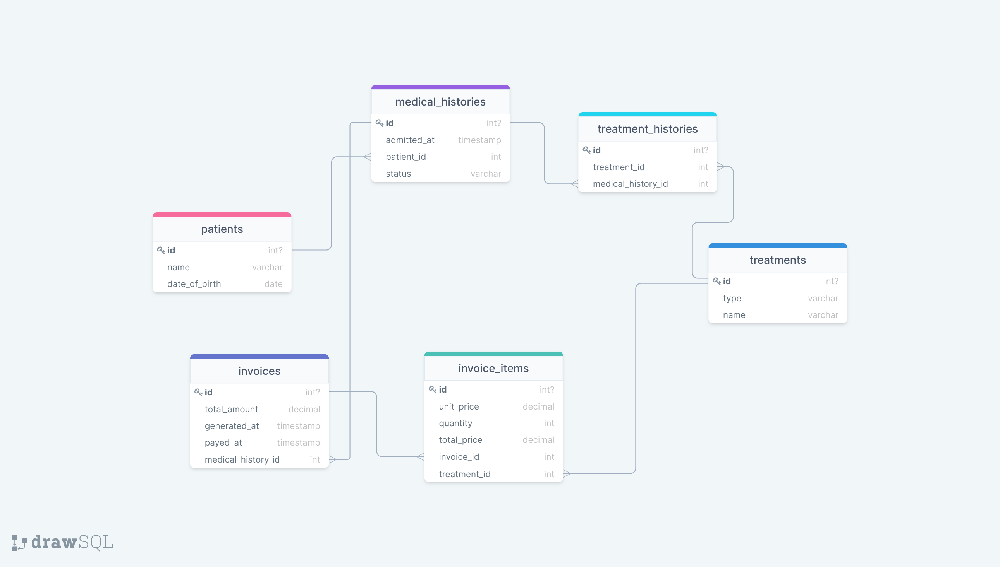

# Hospital

> This project is a database designed to store information about the patients treated at the Hospital.

## Getting Started

This repository includes files with plain SQL that can be used to recreate a database:

- Use [schema.sql](./schema.sql) to create all tables.

## Authors

👤 **Santiago Velosa**

- GitHub: [@vechicin](https://github.com/vechicin)
- Twitter: [@therealvelosa](https://twitter.com/therealvelosa)
- LinkedIn: [Santiago Velosa](https://www.linkedin.com/in/santiago-velosa-arias/)

👤 **Luis Abarca**

- GitHub: [@TheLuisAbarca](https://github.com/theLuisAbarca/)
- Twitter: [@TheLuisAbarca](https://twitter.com/TheLuisAbarca)
- LinkedIn: [Luís Anghelo Abarca Villacís](https://www.linkedin.com/in/techadvisor-luis-abarca/)

## 🤝 Contributing

Contributions, issues, and feature requests are welcome!

Feel free to check the [issues page](../../issues/).

## Show your support

Give a ⭐️ if you like this project!

## Acknowledgments

- Microverse

## 📝 License

This project is [MIT](./MIT.md) licensed.
